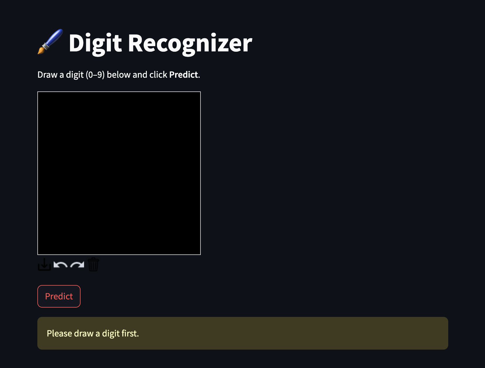
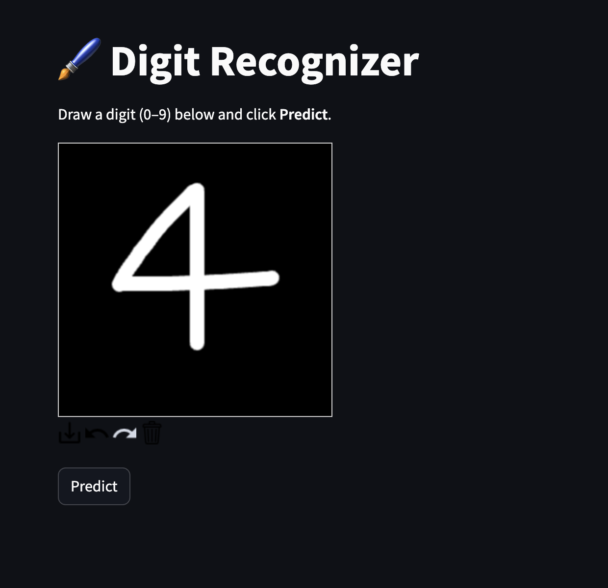
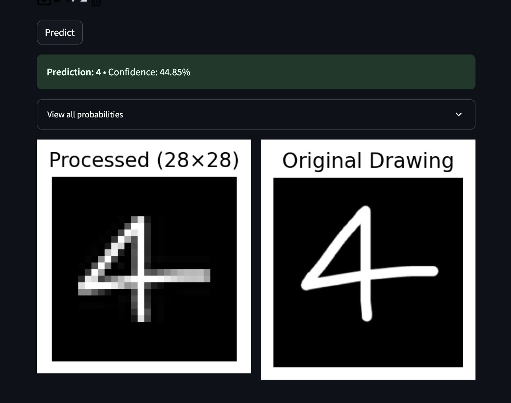

# 🧠 MNIST Digit Recognizer with Streamlit & PyTorch

This is a web application that allows users to draw digits (0–9) on a canvas and receive real-time predictions using a neural network trained on the MNIST dataset.

---

## 📸 Demo Preview

![MNIST Digit Drawing App Screenshot]



---

## 🔍 Features

- ✏️ Interactive drawing canvas powered by Streamlit
- 🔮 Real-time digit prediction using a PyTorch neural network model
- 📊 Confidence scores and probability distribution for all digits
- 🖼️ MNIST-style image preprocessing with proper centering and aspect ratio preservation
- 📈 Visual comparison between original drawing and processed model input

---

## 🛠 Technologies Used

- **Python 3.12**
- **Streamlit** – Frontend interface and canvas
- **PyTorch** – Neural network model for digit recognition
- **Matplotlib** – Image visualization and display
- **PIL (Pillow)** – Image processing and preprocessing
- **NumPy** – Numerical computations
- **streamlit-drawable-canvas** – Interactive drawing interface

---

## 🧠 Model Details

The model is a simple fully connected neural network trained with PyTorch on the MNIST dataset.

- **Architecture**: 784 → 128 → 10 (ReLU activation)
- **Input**: 28x28 grayscale image (flattened to 784 features)
- **Output**: Softmax probabilities for digits 0–9
- **Preprocessing**: Smart cropping, centering, and aspect ratio preservation to match MNIST format

---

## 🚀 How to Run Locally

```bash
# Install required dependencies
pip install streamlit torch torchvision pillow numpy matplotlib streamlit-drawable-canvas

# Place your trained model file as 'mnist_model.pt' in the same directory

# Run the application
streamlit run app.py
```

Once running, visit `http://localhost:8501` in your browser.

## 🧪 How to Run Locally with Docker

```bash
# Clone the repository
git clone https://github.com/Kadriye/mnist-streamlit-docker.git
cd mnist-streamlit-docker

# Build and run with Docker Compose
docker-compose up --build
```

Once running, visit `http://localhost:8501` in your browser.

---

## 🗃 Database Schema (PostgreSQL)

| Column       | Type        | Description                         |
|--------------|-------------|-------------------------------------|
| `id`         | SERIAL      | Primary key                         |
| `prediction` | INTEGER     | Model's predicted digit             |
| `confidence` | FLOAT       | Confidence score                    |
| `true_label` | INTEGER     | Ground truth label (optional)       |
| `image_data` | BYTEA       | PNG-encoded drawing                 |
| `created_at` | TIMESTAMP   | Log timestamp                       |

---

## 📁 Project Structure

```
mnist-streamlit-app/
├── app.py                 # Main Streamlit application
├── mnist_model.pt         # Trained PyTorch model weights
└── requirements.txt       # Python dependencies
```

---

## 🎨 How It Works

1. **Draw** a digit (0-9) on the black canvas using white strokes
2. **Click Predict** to process your drawing
3. The app automatically:
   - Finds the bounding box of your drawing
   - Centers it properly in a 28x28 frame (like MNIST)
   - Maintains aspect ratio during resizing
   - Applies normalization
4. **View Results** including prediction, confidence, and all digit probabilities
5. **Compare** your original drawing with the processed 28x28 input

---

## 🔧 Key Features

- **Smart Preprocessing**: Automatically crops, centers, and resizes drawings to match MNIST format
- **Aspect Ratio Preservation**: Maintains digit proportions during resizing
- **Visual Feedback**: Shows both original and processed images for transparency
- **Probability Distribution**: View confidence scores for all 10 digits
- **Clean Interface**: Simple, intuitive design focused on functionality

---

## 📦 Dependencies

```txt
streamlit
torch
torchvision
pillow
numpy
matplotlib
streamlit-drawable-canvas
```

---

## 🎯 Tips for Best Results

- Draw digits clearly with good contrast
- Use the full canvas space
- Make digits reasonably thick (stroke width: 15)
- Center your drawing roughly in the canvas
- Try different writing styles if predictions seem off

## 🧪 How to Run Locally with Docker

```bash
# Clone the repository
git clone https://github.com/Zeni1210/digit-doodle-predictor.git
cd mnist-streamlit-docker

# Build and run with Docker Compose
docker-compose up --build
```

Once running, visit `http://localhost:8501` in your browser.

---

## 🗃 Database Schema (PostgreSQL)

| Column       | Type        | Description                         |
|--------------|-------------|-------------------------------------|
| `id`         | SERIAL      | Primary key                         |
| `prediction` | INTEGER     | Model's predicted digit             |
| `confidence` | FLOAT       | Confidence score                    |
| `true_label` | INTEGER     | Ground truth label (optional)       |
| `image_data` | BYTEA       | PNG-encoded drawing                 |
| `created_at` | TIMESTAMP   | Log timestamp                       |

---
